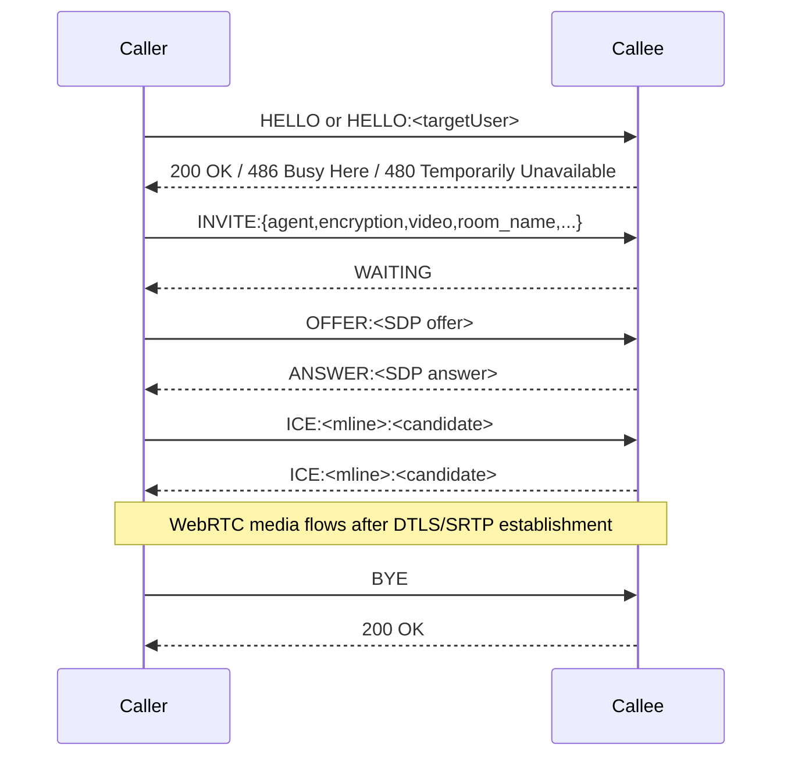
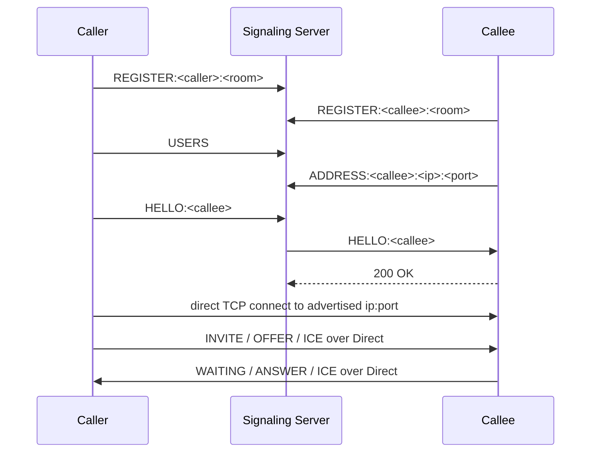

# Direct Protocol

This document describes the proprietary `Direct` signaling protocol used by `directcall` for caller/callee discovery, call setup, WebRTC SDP/ICE exchange, and optional Whisper/Llama side-channel messages.

## Overview

`Direct` is a text-based signaling protocol layered on top of either:

| Transport | Typical use | Notes |
| --- | --- | --- |
| Raw TCP | Native caller to native callee | Plain framed signaling between peers |
| Raw WebSocket | Registration and name-based discovery | Signaling server only routes messages |
| HTTP polling bridge | Browser demo | `local_signal_server.py` translates browser JSON to `Direct` |

The signaling server does not parse or modify SDP or ICE payloads. It only forwards protocol lines between connected peers.

## Message Grammar

Every protocol line starts with a command token and may optionally carry a payload.

Accepted payload forms:

```text
COMMAND
COMMAND:<payload>
COMMAND <payload>
```

Typical payloads:

- JSON blobs for `INVITE`
- SDP text for `OFFER` and `ANSWER`
- ICE candidate strings for `ICE`
- user IDs and IP/port tuples for `REGISTER`, `USERS`, and `ADDRESS`

## Message Types

### Status Codes

```text
200 OK
400 Bad Request
480 Temporarily Unavailable
486 Busy Here
```

### Call Control

```text
HELLO
HELLO:<targetUser>
INVITE
INVITE:{"agent":"audio","encryption":true,"video":true,"room_name":"room101"}
WAITING
OFFER:<sdp>
ANSWER:<sdp>
ICE:<mline>:<candidate>
BYE
CANCEL
```

### Discovery And Routing

```text
REGISTER:<id>:<room>
USERS
USERS:<comma-separated-user-ids>
ADDRESS:<id>:<ip>:<port>
```

### Optional AI Side-Channel

```text
WHISPER:[en]hello there
LLAMA:[en]hi, how can I help?
```

## Native Raw TCP Flow



## Signaling-Server Flow

For name-based calling, both peers first connect to the signaling server over raw WebSocket and register in a room.



Key points:

- WebSocket registration is used for discovery.
- The actual native call still prefers direct peer-to-peer TCP signaling after address resolution.
- `ADDRESS` publishes the callee's direct TCP listener, not a UDP reflexive endpoint.

## Browser Bridge Flow

The browser demo does not speak `Direct` directly. Instead:

1. The browser creates a normal `RTCPeerConnection`.
2. `local-demo.html` posts JSON `offer` and `ice` messages to `local_signal_server.py`.
3. `local_signal_server.py` opens a TCP connection to the callee and translates browser signaling into:
   - `HELLO`
   - `INVITE:{...}`
   - `OFFER:<sdp>`
   - `ICE:<mline>:<candidate>`
4. The bridge converts:
   - `ANSWER:<sdp>` back into browser JSON answer
   - `ICE:<mline>:<candidate>` back into browser JSON candidates

This lets a regular webpage receive the AI callee's WebRTC audio and video without implementing the native framing rules.

## Direct Callee Answering

There are two answer paths in the implementation:

### 1. Native Raw TCP Callee

- The callee listens on a TCP port.
- On `HELLO`, it returns `200 OK` if available.
- On `INVITE`, it stores the remote agent capability and returns `WAITING`.
- On `OFFER`, it buffers fragments until a valid SDP offer parses.
- It then sets the remote description, creates an answer, and returns `ANSWER:<sdp>`.
- ICE candidates are exchanged using `ICE:<mline>:<candidate>`.

### 2. Signaling-Client Callee

- The callee registers with the signaling server.
- On `HELLO` or `OFFER` received through WebSocket, it creates a local answer in `DirectCalleeClient`.
- The answer is JSON-wrapped for browser compatibility before being sent through the WebSocket transport.

## SDP And ICE Handling Rules

- `OFFER` and `ANSWER` may arrive fragmented on the TCP transport.
- The implementation appends fragments until `CreateSessionDescription(...)` succeeds.
- ICE candidates that arrive early are queued until both local and remote descriptions are set.
- The protocol uses a single text line per candidate:

```text
ICE:<mline-index>:candidate:...
```

## AI Media Behavior

### Audio

- Incoming remote audio is fed into Whisper.
- Whisper text may be sent to Llama.
- Llama output is either:
  - spoken locally and transmitted as WebRTC audio when the peer advertises `agent="audio"`, or
  - emitted as `LLAMA:[lang]text` when the peer is text-only.

### Video

- If `--talking_face=<image>` or `talking_face` is set in config, the callee loads a static avatar image.
- TTS PCM is fed into `TalkingFace::feedAudio()`.
- `TalkingFaceRenderer` renders YUV420 frames at 24 fps into a fake WebRTC video source.
- That source is attached as the outgoing video track, so the remote peer sees the avatar "speaking".

## Example INVITE Payload

```json
{
  "agent": "audio",
  "encryption": true,
  "video": true,
  "llama_model": "Qwen3.5-9B-Q3_K_M.gguf",
  "room_name": "room101"
}
```

## Operational Notes

- `486 Busy Here` means the callee already has an active call.
- `CANCEL` aborts an in-progress attempt and resets the session without fully tearing down the listener.
- `BYE` performs a graceful hang-up; the expected response is `200 OK`.
- `REGISTER` must be sent before `USERS` or `ADDRESS` on the signaling-server path.
- TURN config is supplied as `uri,username,password` triples and may be repeated with `;` separators.

## Recommended Browser Demo Shape

For a web page that calls the AI app and receives the animated avatar:

1. Start `directcall` in callee mode with `talking_face` enabled.
2. Start `local_signal_server.py`.
3. Open `local-demo.html`.
4. Click the call button.
5. The browser receives:
   - remote audio from the AI callee
   - remote video containing the animated talking-face avatar
